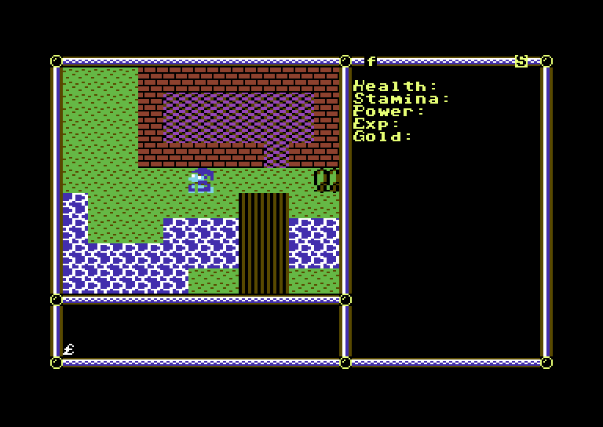

# CRPG for Commodore 64

This is an attempt at making a sort of CRPG for Commodore 64. It features a top down view and a first person dungeon crawler. Written mostly in C with the ocassional assembly subroutine.

## Why is the C code so weird?
Although cc65 can compile pretty standard C code with boring old libraries just fine, optimizing it for speed requires doing some strange things. I suggest taking a look at [this repo for more information](https://github.com/ilmenit/CC65-Advanced-Optimizations). I even bothered to learn a bit of 6502 assembly just to make sure I was doing some things relatively optimally.

There's also the chance I might be a horrible coder in some spots, but this is kind of a learning exercise honestly.

## Will you finish this?
Probably not. Who knows. Mayhaps. Perchance. The lack of a proper IDE kills me.

