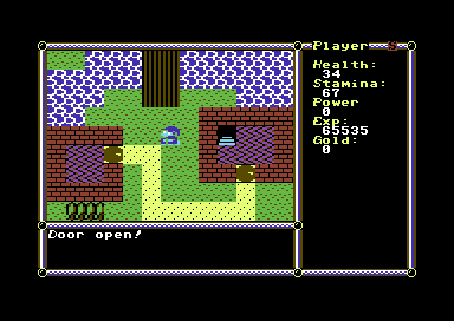

# CRPG for Commodore 64

This is an attempt at making a sort of CRPG for Commodore 64. Written in 6502 assembly.

## So what is this?
This is sort of a learning project. I started out writing everything in C, but eventually learned 6502 assembly and the overall architecture of the Commodore 64. Now there's no C code, since cc65 is not very good at high level optimizations. Oh well, it was fun while it lasted.

## Will you finish this?
We'll see.

## Building
To build the game, you need to install `make`, `cc65`, [`cc1541` (v4.2)](https://csdb.dk/release/?id=240041) and [`mapp`](https://github.com/animasodo/mapp) in a folder that can be accessed system or user-wide. Then just run the makefile.